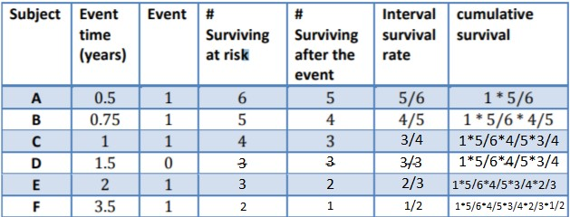

```{r setup, include=FALSE}
library(survminer)
knitr::opts_chunk$set(echo = TRUE)
```

## Create a Kaplan-Meir survival curve

Using	the	R	package	survival generate	survival	data	and	plot	a	K-M	curve	for	the	data	shown	in	the	table.	Check	analytically	the	observed		values	using	the	Equation	from	the	slides.	

```{r}
library(survival)
events = c(1,1,1,0,1,1)
time = c(0.5, 0.75, 1, 1.5, 2, 3.5)
plot(survfit(Surv(time,events)~1))
```

If we compare the curve obtained with the results that we have:



We can easely check that the curve obtained matches with the results that we have.


## 	Create	a	Cox	regression	model

Use	the	dataset	lung	and	make	a	prediction	on	some	novel	cases.	Compute	a	survival	curve	with	the	predictions	obtained	from	two	different	groups	(i.e,		groups	with	age	lower	than	60	and	older	than	60).

I am going to use the **lung** dataset. We can find it in the survival package, and to use it, we just have to write `lung`.

I am going to start with the example proposed.

```{r}
df<-lung
df$age<-cut(lung$age, breaks = c(1,60,100))
plot(survfit(Surv(time,status)~age, df))
```

We can improve this graph using *ggsurvplot*:

```{r}
ggsurvplot(survfit(Surv(time,status)~age, df), conf.int = TRUE, censor= TRUE, cex.axis=3, cex.lab=3.0, main="Survival curve Age grouping", pval = TRUE)
```

  
As we can see, we do not have a meaningful difference between this two curves. We can check another parameter, for example, **sex**. We get a meaningful difference between the curves. Which means, we can find groups of patients with sirvivals more different between them using the sex to separate the patients, in stead of the age ranges.


```{r}
ggsurvplot(survfit(Surv(time,status)~sex, df), conf.int = TRUE, censor= TRUE, cex.axis=3, cex.lab=3.0, main="Survival curve Age grouping", pval = TRUE)
```


## Summary	of	Ref.	[P3-R1]

Write	with	your	own	words	a	short	summary	of	the	most	relevant	methods	and	findings	of	this	work. *[P3-R1]	Van	't	Veer	L.J., Dai	H.,	Van	de	Vijver	M.J.,	et	al.	Gene	expression	profiling	predicts	clinical	outcome	of	breast	cancer.	Nature,	415,	pp.	530-536	(2002).*


####Summary.

The paper aims to find a strategy to select patients who would benefit from adjuvant therapy.

First of all, 98 primary breast cancers were selected. After the lab work, they end up having about 5000 genes that were significantly regulated across the group of samples. Then, an unsupervised hierarchical clustering allowed them to cluster the 98 tumors according to their similarity measures. The 5000 genes were clustered over 98 groups, where we can see two dominant types of tumors. Thus, using unsupervised clustering we can already distinguish between good and poor prognosis. To gain insight of this groups, histopathological data was associated. They conclude saying that unsupervised learning detects two subgroups of breast cancers, which differ in ER status and lymphocytic infiltration.

Afterwards, a three-step supervised clasification was applied:

- From the 25000 genes 231 were  significantly associated with the disease.
- These genes were ordered.
- Optimize the number of genes in the 'prognosis classifier'.

The functional anotation for the genes provides insight into the underlying biological mechanism leading to rapid metastases. To validate prognosis classifier, an additional set of primary tumors from 19 young, lymph-node-negative breast cancer patients was selected. The prediction of the classifier presented would indicate that women under 55with poor prognosis have a 28-fold odds to develop a distant metastasis within 5 years.


To investigate the expression patterns associated with the immunohistochemical staining of ER a two layer classification was performed. They observed with supervised learning, is that ER has predictive power for prognosis. Their results end up indicating that breast cancer prognosis can already be derived from the gene expression profile of the primary tumour. Finally, they applied the St. Gallen and NIH cinsensus criteria on our patient group. And we saw that it can select just as effectively those high-risk, and reduces significantly the unnecesary treatment.


